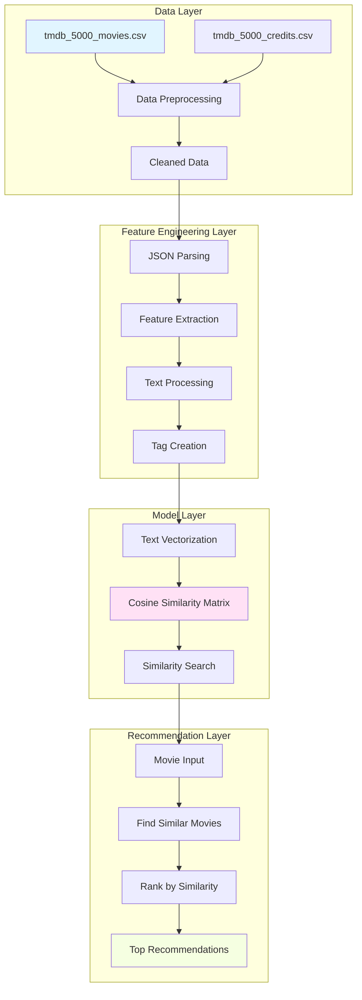
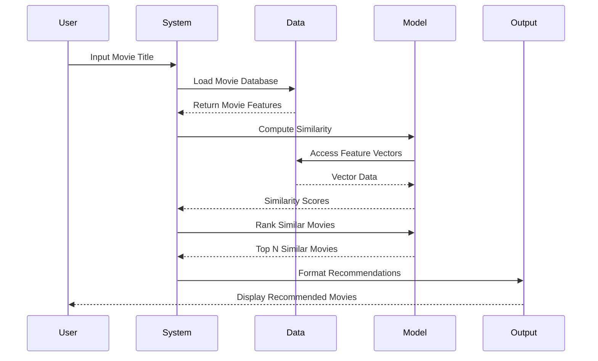
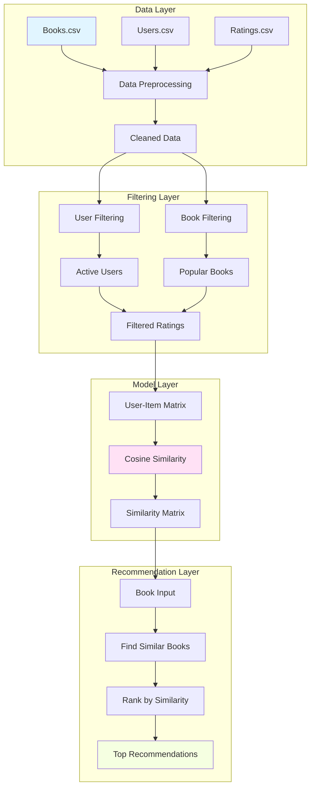
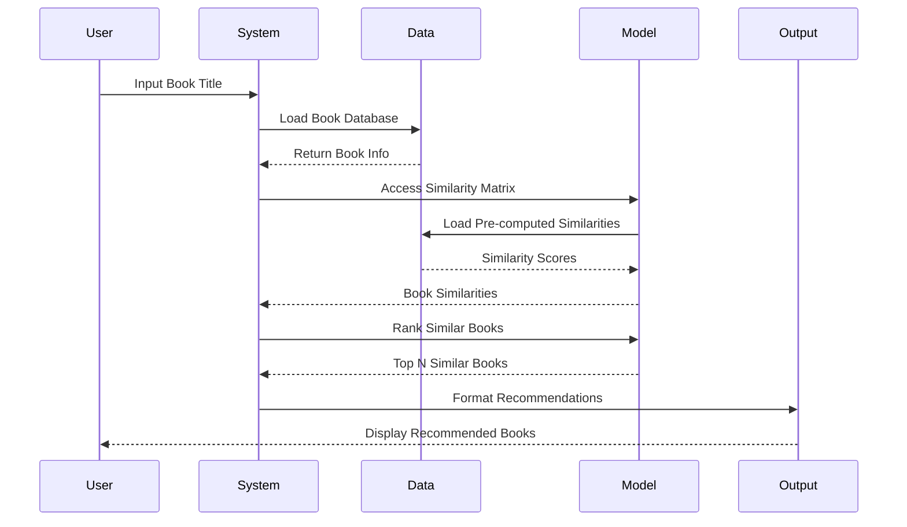
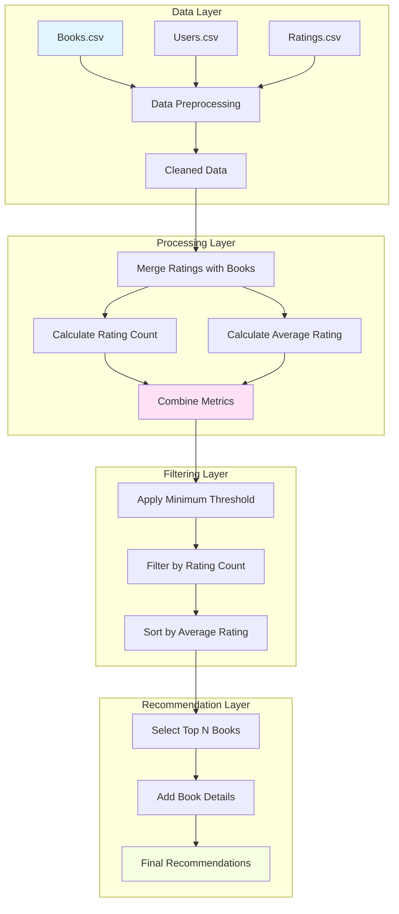
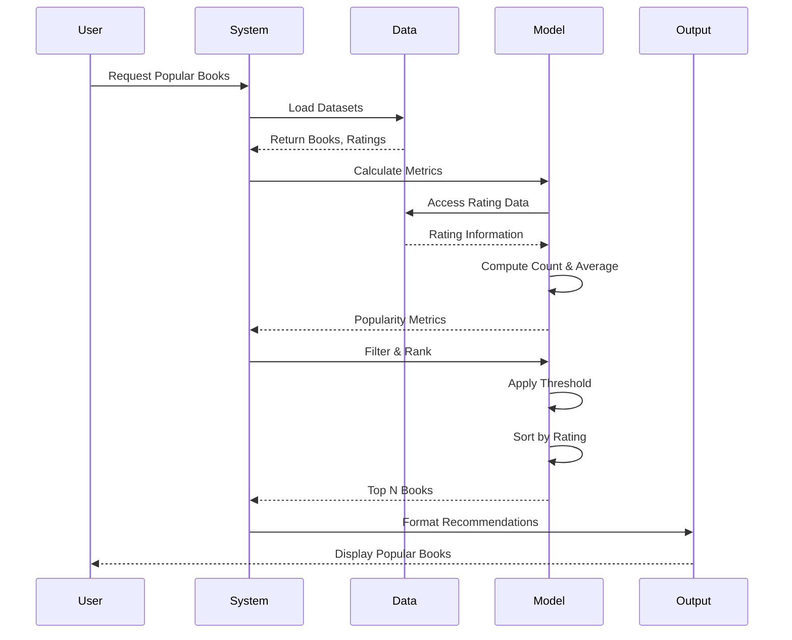
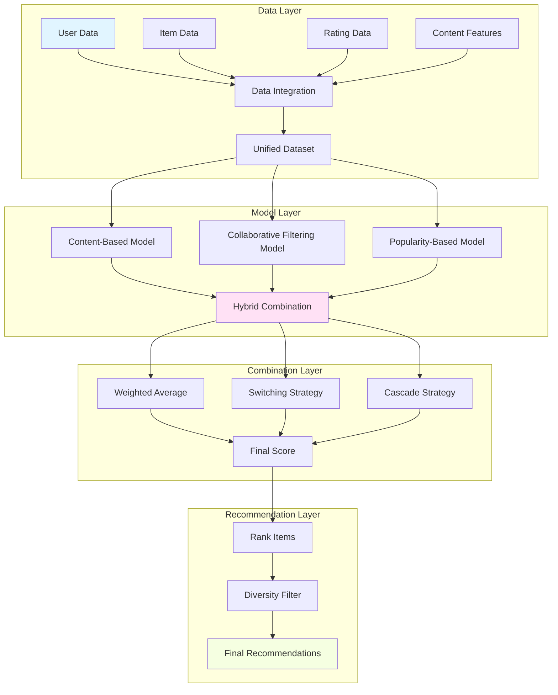
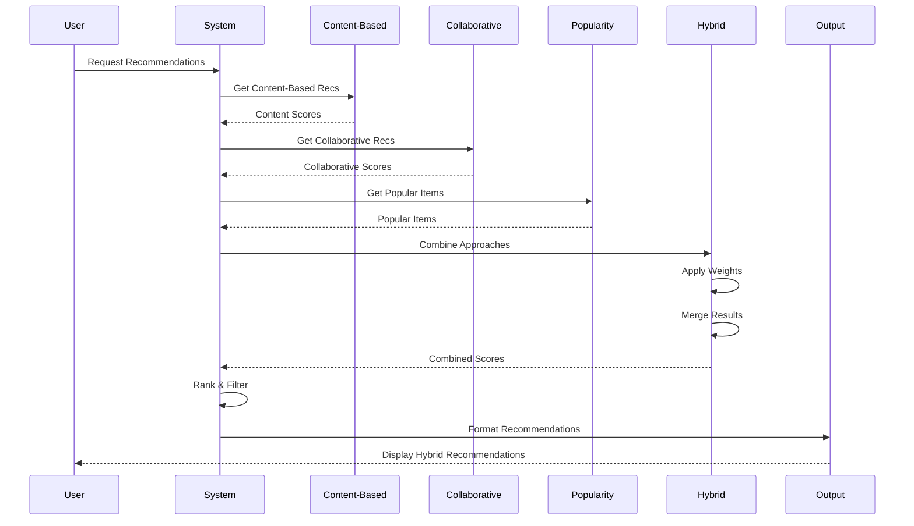

# Recommendation System - End-to-End Projects

This repository contains comprehensive end-to-end implementation of various types of recommendation systems, including content-based filtering, collaborative filtering, and hybrid approaches.

## 📋 Table of Contents

- [Project Overview](#project-overview)
- [Repository Structure](#repository-structure)
- [Content-Based Recommendation System](#content-based-recommendation-system)
- [Collaborative Filtering](#collaborative-filtering)
- [Popularity-Based Recommendation System](#popularity-based-recommendation-system)
- [Hybrid Recommendation Systems](#hybrid-recommendation-systems)
- [Installation & Setup](#installation--setup)
- [Usage](#usage)
- [Project Phases](#project-phases)
- [Technologies Used](#technologies-used)
- [Contributing](#contributing)
- [License](#license)

## 🎯 Project Overview

This repository demonstrates the complete end-to-end development of recommendation systems, from data preprocessing to model implementation. The project covers four major approaches:

1. **Content-Based Filtering**: Recommends items based on feature similarity (movies)
2. **Collaborative Filtering**: Recommends items based on user behavior patterns (books)
3. **Popularity-Based Filtering**: Recommends items based on overall popularity (books)
4. **Hybrid Systems**: Combines multiple approaches for improved recommendations (educational resources)

## 📁 Repository Structure

```
RECOMMENDATION SYSTEM/
├── Content based Recommendation system/
│   ├── PHASE 1 /
│   │   ├── README.md                          # Detailed documentation
│   │   ├── notebooks_Movie-recommendation system_movie-recommendation syste.ipynb
│   │   ├── roughnotes.md                      # Implementation notes & debugging
│   │   ├── tmdb_5000_movies.csv              # Movie metadata dataset
│   │   └── tmdb_5000_credits.csv             # Cast and crew dataset
│   └── PHASE 2/
│       ├── Summary and errors.md              # Project summary
│       ├── roughnotes2.md                     # Additional notes
│       ├── handwritten notes.pdf             # Reference materials
│       ├── notebooks_Movie-recommendation system_movie-recommendation syste.ipynb
│       └── validation:corefeature notebook end to end working.ipynb
├── Collaborative filtering based/
│   ├── PHASE 1/
│   │   ├── README.md                         # Comprehensive documentation
│   │   ├── Books.csv                         # Book metadata dataset (73MB)
│   │   ├── Users.csv                         # User demographics dataset (11MB)
│   │   ├── Ratings.csv                       # User ratings dataset (22MB)
│   │   ├── Books.ipynb                       # Main Jupyter notebook
│   │   ├── notes.md                          # Implementation notes
│   │   ├── rough_notes.md                     # Rough notes and debugging
│   │   ├── handwritten notes .pdf            # Reference materials
│   │   ├── DeepRec.png                       # Deep learning architecture diagram
│   │   ├── classicRec.png                    # Classic recommendation system diagram
│   │   └── recsys_taxonomy2.png              # Recommendation system taxonomy
│   └── Phase 2/
│       ├── notebooks_Collaborative Filtering Based Recommender for books_Popular-based-recommendation-system.ipynb
│       └── notes.md                          # Phase 2 implementation notes
├── HYBRID/
│   ├── 2.1.1.  Hybrid Recommendation Systems.pdf
│   ├── 2.1.2. Lab_ Designing a Hybrid Recommendation Systems.pdf
│   ├── 2.1.3. Lab_ Designing a Hybrid  Collaborative Filtering Recommendation Systems.pdf
│   ├── 2.1.4. Lab_ Designing a Hybrid  Knowledge-based Recommendation Systems.pdf
│   └── 2.1.6. Lab Solution_ Building a Neural Network Hybrid Recommendation System.pdf
├── Popularity based recommendation system/
│   ├── Books.csv                             # Book metadata dataset (73MB)
│   ├── Users.csv                             # User demographics dataset (11MB)
│   ├── Ratings.csv                           # User ratings dataset (22MB)
│   ├── popular-based-rs.ipynb                # Main Jupyter notebook
│   ├── END_TO_END_NOTES.md                   # Comprehensive implementation notes
│   ├── roughnotes.md                         # Rough notes and debugging
│   ├── handwritten note .pdf                 # Reference materials
│   └── README.md                             # Folder documentation
├── requirements.txt                          # Python dependencies
├── PROJECT_SUMMARY.md                        # Project overview
├── CHANGELOG.md                              # Version history
├── CONTRIBUTING.md                           # Contribution guidelines
├── LICENSE                                  # MIT License
└── README.md                                # This file
```

## 🎬 Content-Based Recommendation System

### Overview
The content-based recommendation system suggests movies based on their features such as genres, keywords, cast, crew, and plot overview.

### System Design & Data Flow



### Data Flow Diagram



### Dataset
- **tmdb_5000_movies.csv**: Contains movie information including budget, genres, keywords, overview, popularity, production companies, release date, revenue, runtime, spoken languages, status, tagline, title, vote average, and vote count
- **tmdb_5000_credits.csv**: Contains cast and crew information for each movie including movie_id, title, cast details, and crew details
- **Dataset Size**: ~4,800 movies

### Features Used
1. **Genres**: Movie categories (Action, Adventure, Fantasy, Science Fiction, etc.)
2. **Keywords**: Plot-relevant terms and themes
3. **Cast**: Top 3 actors from the movie
4. **Crew**: Director of the movie
5. **Overview**: Plot summary and description

### Implementation Details

#### Data Preprocessing
1. **Data Merging**: Combined movies and credits datasets on the title field
2. **Missing Values**: Removed rows with null values in critical fields
3. **Duplicate Removal**: Eliminated duplicate entries
4. **Feature Selection**: Selected relevant columns (movie_id, title, overview, genres, keywords, cast, crew)

#### Text Processing
1. **JSON Parsing**: Converted JSON strings in genres, keywords, cast, and crew to Python lists
2. **Feature Extraction**:
   - Extracted genre names from genre objects
   - Extracted keyword names from keyword objects
   - Extracted top 3 actor names from cast objects
   - Extracted director name from crew objects
3. **Text Cleaning**:
   - Removed spaces from multi-word names (e.g., "Science Fiction" → "ScienceFiction")
   - Split overview text into individual words
   - Converted all text to lowercase
4. **Tag Creation**: Combined all processed features into a single "tags" column for each movie

#### Key Functions
- `convert(obj)`: Extracts names from JSON arrays (used for genres and keywords)
- `convert3(obj)`: Extracts top 3 names from JSON arrays (used for cast)
- `fetch_director(obj)`: Extracts director name from crew JSON array

### How to Use

1. **Load the Datasets**:
   ```python
   import pandas as pd
   movies = pd.read_csv('tmdb_5000_movies.csv')
   credits = pd.read_csv('tmdb_5000_credits.csv')
   ```

2. **Merge and Preprocess**:
   ```python
   movies = movies.merge(credits, on='title')
   movies = movies[['movie_id', 'title', 'overview', 'genres', 'keywords', 'cast', 'crew']]
   ```

3. **Apply Text Processing Functions**:
   ```python
   movies['genres'] = movies['genres'].apply(convert)
   movies['keywords'] = movies['keywords'].apply(convert)
   movies['cast'] = movies['cast'].apply(convert3)
   movies['crew'] = movies['crew'].apply(fetch_director)
   ```

4. **Create Tags**:
   ```python
   movies['tags'] = movies['overview'] + movies['keywords'] + movies['genres'] + movies['cast'] + movies['crew']
   new_df = movies[['movie_id', 'title', 'tags']]
   new_df['tags'] = new_df['tags'].apply(lambda x: " ".join(x)).apply(lambda x: x.lower())
   ```

## 👥 Collaborative Filtering

### Overview
The collaborative filtering recommendation system implements user-based and item-based collaborative filtering algorithms for book recommendations using the Book-Crossing dataset. This approach leverages user-item interactions to deliver personalized reading experiences.

### System Design & Data Flow



### Data Flow Diagram



### Dataset
- **Books.csv** (73MB): Book metadata including ISBN, title, author, year of publication, publisher, and image URLs
- **Users.csv** (11MB): User demographics including User-ID, location, and age (with missing values)
- **Ratings.csv** (22MB): User-book ratings with ~1.1M ratings from ~280K users on ~271K books
- **Rating Scale**: 0 (implicit) to 10 (explicit)
- **Source**: Book-Crossing dataset collected by Cai-Nicolas Ziegler

### Implementation Details

#### PHASE 1: Data Processing & Analysis
- **Data Loading**: Load and validate Books, Users, and Ratings CSV files
- **Data Cleaning**: Handle missing values, remove duplicates, and clean data types
- **User-Item Matrix**: Create pivot table of books × users with ratings
- **Similarity Calculation**: Compute cosine similarity between books
- **Recommendation Engine**: Generate book recommendations based on similarity scores

#### PHASE 2: Advanced Collaborative Filtering
- **Item-Based CF**: Find books similar to user's favorites using cosine similarity
- **User Filtering**: Filter active users (rated >200 books) and popular books (rated >50 times)
- **Similarity Matrix**: Pre-compute item-item similarity matrix for efficient recommendations
- **Recommendation Function**: Returns top 5 similar books for any given book

### Key Features
- **User-Based Collaborative Filtering**: Find similar users based on rating patterns
- **Item-Based Collaborative Filtering**: Recommend books similar to user's favorites
- **Cosine Similarity**: Measure similarity between books using rating patterns
- **Cold-Start Handling**: Strategies for new users and items
- **Performance Optimization**: Sparse matrix operations and efficient similarity calculations

### How to Use

1. **Load the Datasets**:
   ```python
   import pandas as pd
   books = pd.read_csv('Books.csv', sep=';', error_bad_lines=False, encoding='latin-1')
   users = pd.read_csv('Users.csv', sep=';', error_bad_lines=False, encoding='latin-1')
   ratings = pd.read_csv('Ratings.csv', sep=';', error_bad_lines=False, encoding='latin-1')
   ```

2. **Filter Active Users and Popular Books**:
   ```python
   x = ratings['User-ID'].value_counts() > 200
   active_users = x[x].index
   ratings = ratings[ratings['User-ID'].isin(active_users)]
   
   y = ratings['Book-Title'].value_counts() > 50
   famous_books = y[y].index
   ratings = ratings[ratings['Book-Title'].isin(famous_books)]
   ```

3. **Create User-Item Matrix**:
   ```python
   pt = ratings.pivot_table(index='Book-Title', columns='User-ID', values='Book-Rating')
   pt.fillna(0, inplace=True)
   ```

4. **Compute Similarity Scores**:
   ```python
   from sklearn.metrics.pairwise import cosine_similarity
   similarity_scores = cosine_similarity(pt)
   ```

5. **Generate Recommendations**:
   ```python
   def recommend(book_name):
       index = np.where(pt.index == book_name)[0][0]
       distances = similarity_scores[index]
       similar_items = sorted(list(enumerate(distances)), key=lambda x: x[1], reverse=True)[1:6]
       for item in similar_items:
           print(pt.index[item[0]])
   ```

### Files Structure
- **Books.ipynb**: Main Jupyter notebook with complete implementation
- **notes.md**: Detailed implementation notes and documentation
- **rough_notes.md**: Rough notes and debugging information
- **handwritten notes .pdf**: Reference materials and diagrams
- **DeepRec.png**: Deep learning recommendation architecture diagram
- **classicRec.png**: Classic recommendation system diagram
- **recsys_taxonomy2.png**: Recommendation system taxonomy

### Technologies Used
- Python 3.8+
- Pandas (data manipulation)
- NumPy (numerical computing)
- Scikit-learn (machine learning algorithms)
- SciPy (scientific computing)
- Jupyter Notebook (interactive development)

## 🌟 Popularity-Based Recommendation System

### Overview
The popularity-based recommendation system suggests books based on their overall popularity among all users. Unlike collaborative filtering or content-based systems, it doesn't personalize recommendations but instead shows what's trending or highly rated by the general population. This serves as an excellent baseline and fallback mechanism.

### System Design & Data Flow



### Data Flow Diagram



### Dataset
- **Books.csv** (73MB): Book metadata including ISBN, title, author, year of publication, publisher, and image URLs
- **Users.csv** (11MB): User demographics including User-ID, location, and age
- **Ratings.csv** (22MB): User-book ratings with ~1.1M ratings from ~280K users on ~271K books
- **Source**: Book-Crossing dataset

### Implementation Details

#### Algorithm Approach
1. **Data Merging**: Combine ratings with book information using ISBN
2. **Rating Count Calculation**: Count number of ratings per book
3. **Average Rating Calculation**: Compute mean rating for each book
4. **Filtering**: Apply minimum rating threshold (250+ ratings)
5. **Ranking**: Sort by average rating and select top 50 books

#### Key Metrics
- **Number of Ratings**: Total ratings received by each book
- **Average Rating**: Mean rating score (0-10 scale)
- **Minimum Threshold**: 250+ ratings to ensure statistical significance
- **Top Recommendations**: Top 50 highly-rated popular books

### How to Use

1. **Load the Datasets**:
   ```python
   import pandas as pd
   books = pd.read_csv('Books.csv')
   users = pd.read_csv('Users.csv')
   ratings = pd.read_csv('Ratings.csv')
   ```

2. **Merge Ratings with Book Information**:
   ```python
   rating_with_name = ratings.merge(books, on='ISBN')
   ```

3. **Calculate Rating Metrics**:
   ```python
   num_rating_df = rating_with_name.groupby('Book-Title').count()['Book-Rating'].reset_index()
   num_rating_df.rename(columns={'Book-Rating': 'num_ratings'}, inplace=True)
   
   avg_rating_df = rating_with_name.groupby('Book-Title')['Book-Rating'].mean().reset_index()
   avg_rating_df.rename(columns={'Book-Rating': 'avg_rating'}, inplace=True)
   ```

4. **Combine and Filter**:
   ```python
   popular_df = num_rating_df.merge(avg_rating_df, on='Book-Title')
   popular_df = popular_df[popular_df['num_ratings'] >= 250]
   popular_df = popular_df.sort_values('avg_rating', ascending=False).head(50)
   ```

5. **Add Book Details**:
   ```python
   popular_df = popular_df.merge(books, on='Book-Title') \
       .drop_duplicates('Book-Title') \
       [['Book-Title', 'Book-Author', 'Publisher', 'Image-URL-M', 'num_ratings', 'avg_rating']]
   ```

### Key Features
- **Simple Implementation**: Basic statistical calculations
- **Cold-Start Resistant**: Works well even with new users/items
- **Scalable**: Computationally efficient
- **No Personalization**: Same recommendations for all users
- **Baseline System**: Serves as foundation for more complex systems

### Advantages
- Simple and interpretable
- No cold-start problem
- Fast computation
- Works with sparse data
- Reliable baseline for comparison

### Limitations
- No personalization
- Bias toward older books (more time to accumulate ratings)
- May not reflect current trends
- Doesn't account for user preferences

### Files Structure
- **popular-based-rs.ipynb**: Main Jupyter notebook with implementation
- **END_TO_END_NOTES.md**: Comprehensive end-to-end implementation notes
- **roughnotes.md**: Rough notes and debugging information
- **handwritten note .pdf**: Reference materials
- **README.md**: Folder documentation

### Technologies Used
- Python 3.x
- Pandas (data manipulation)
- NumPy (numerical computing)
- Jupyter Notebook (interactive development)

## 🔄 Hybrid Recommendation Systems

### Overview
This folder contains educational resources and lab materials for designing and implementing hybrid recommendation systems that combine multiple recommendation approaches for improved performance.

### System Design & Data Flow



### Data Flow Diagram



### Learning Resources
This folder contains educational resources and lab materials for designing and implementing hybrid recommendation systems:

- **2.1.1. Hybrid Recommendation Systems.pdf** - Introduction to hybrid recommendation systems concepts and architectures
- **2.1.2. Lab_ Designing a Hybrid Recommendation Systems.pdf** - Hands-on lab for designing hybrid recommendation systems
- **2.1.3. Lab_ Designing a Hybrid Collaborative Filtering Recommendation Systems.pdf** - Lab focused on hybrid collaborative filtering approaches
- **2.1.4. Lab_ Designing a Hybrid Knowledge-based Recommendation Systems.pdf** - Lab for knowledge-based hybrid recommendation systems
- **2.1.6. Lab Solution_ Building a Neural Network Hybrid Recommendation System.pdf** - Complete solution for building neural network-based hybrid recommendation systems

### Learning Objectives
- Understand different hybrid recommendation system architectures
- Learn to combine multiple recommendation approaches effectively
- Implement collaborative filtering hybrid systems
- Build knowledge-based hybrid recommenders
- Develop neural network-based hybrid recommendation systems

## �️ Installation & Setup

### Prerequisites
- Python 3.x
- Jupyter Notebook/JupyterLab
- Git

### Required Packages
```bash
pip install pandas numpy scikit-learn nltk
```

### Setup Instructions

1. **Clone the repository**:
   ```bash
   git clone <repository-url>
   cd RECOMMENDATION\ SYSTEM
   ```

2. **Install dependencies**:
   ```bash
   pip install -r requirements.txt
   ```

3. **Launch Jupyter Notebook**:
   ```bash
   jupyter notebook
   ```

4. **Navigate to the desired phase**:
   - For content-based filtering: `Content based Recommendation system/PHASE 1/`
   - For validation and advanced features: `Content based Recommendation system/PHASE 2/`

## 📖 Usage

### Running the Content-Based Recommendation System

1. Open `Content based Recommendation system/PHASE 1 /notebooks_Movie-recommendation system_movie-recommendation syste.ipynb`
2. Execute cells sequentially to:
   - Load datasets
   - Preprocess data
   - Extract features
   - Create tags
   - Build recommendation model

### Running Validation Notebook

1. Open `Content based Recommendation system/PHASE 2/validation:corefeature notebook end to end working.ipynb`
2. This notebook contains the validated end-to-end implementation

### Running the Collaborative Filtering System

1. Open `Collaborative filtering based/PHASE 1/Books.ipynb`
2. Execute cells sequentially to:
   - Load Books, Users, and Ratings datasets
   - Filter active users and popular books
   - Create user-item matrix
   - Compute similarity scores
   - Generate book recommendations

3. For advanced implementation, open `Collaborative filtering based/Phase 2/notebooks_Collaborative Filtering Based Recommender for books_Popular-based-recommendation-system.ipynb`

### Running the Popularity-Based Recommendation System

1. Open `Popularity based recommendation system/popular-based-rs.ipynb`
2. Execute cells sequentially to:
   - Load Books, Users, and Ratings datasets
   - Merge ratings with book information
   - Calculate rating metrics
   - Filter and rank popular books
   - Generate top 50 recommendations

### Accessing Learning Materials

Navigate to the `HYBRID` folder to access PDF learning materials for hybrid recommendation systems.

## 📊 Project Phases

### Content-Based System Phases

#### PHASE 1: Data Preprocessing & Feature Engineering
- Dataset loading and exploration
- Data cleaning and preprocessing
- Feature extraction from JSON fields
- Text processing and tag creation
- Basic recommendation pipeline setup

#### PHASE 2: Validation & Advanced Features
- End-to-end validation of the recommendation system
- Error handling and debugging
- Performance optimization
- Advanced feature engineering
- Comprehensive documentation

### Collaborative Filtering Phases

#### PHASE 1: Data Processing & Analysis
- Dataset loading and validation
- Data cleaning and preprocessing
- User-item matrix creation
- Similarity calculation
- Basic recommendation engine

#### PHASE 2: Advanced Collaborative Filtering
- Item-based collaborative filtering
- User filtering and book filtering
- Similarity matrix pre-computation
- Recommendation function implementation
- Performance optimization

## 🔧 Technologies Used

- **Python**: Core programming language
- **Pandas**: Data manipulation and analysis
- **NumPy**: Numerical computing
- **Scikit-learn**: Machine learning algorithms and metrics
- **Jupyter Notebook**: Interactive development environment
- **NLTK**: Natural language processing (for future enhancements)

## 📈 Future Enhancements

### Content-Based System
- Implement vectorization (TF-IDF or CountVectorizer)
- Add cosine similarity calculation
- Create a recommendation function that returns similar movies
- Build a user interface for movie recommendations
- Add evaluation metrics to assess recommendation quality

### Collaborative Filtering
- Implement matrix factorization with SVD
- Add user-based collaborative filtering
- Implement evaluation metrics (RMSE, MAE, Precision@K)
- Add cold-start problem handling
- Implement real-time recommendation updates

### Popularity-Based System
- Implement weighted rating system
- Add time-based decay for recent ratings
- Implement category-based popularity
- Add real-time popularity updates

### General
- Develop hybrid recommendation systems
- Add real-time recommendation capabilities
- **Deploy as a web application using Streamlit on Heroku (Pending)**
- Add A/B testing framework
- Implement recommendation diversity algorithms

## 🎓 Methodology

### Content-Based Filtering
Content-based filtering works by:
1. Analyzing the features of items (movies in this case)
2. Creating a profile for each item based on its features
3. Recommending items that are similar to items the user has liked in the past
4. Similarity is typically measured using cosine similarity between feature vectors

### Advantages
- No cold-start problem for new items
- Transparent recommendations (can explain why a movie was recommended)
- User independence (doesn't require other users' data)
- Can recommend niche items to users with specific tastes

### Limitations
- Limited content analysis (only uses provided features)
- No serendipity (recommends only similar items)
- Requires good feature extraction
- Over-specialization (recommends only items similar to what user already knows)

## 🤝 Contributing

Contributions are welcome! Please follow these steps:

1. Fork the repository
2. Create a feature branch (`git checkout -b feature/AmazingFeature`)
3. Commit your changes (`git commit -m 'Add some AmazingFeature'`)
4. Push to the branch (`git push origin feature/AmazingFeature`)
5. Open a Pull Request

## 📝 Credits

- **Dataset**: TMDB (The Movie Database)
- **Implementation**: Based on content-based filtering principles and machine learning best practices
- **Learning Materials**: Hybrid recommendation system labs and tutorials

## 📄 License

This project is licensed under the MIT License - see the LICENSE file for details.

## 📞 Contact

For questions, suggestions, or issues, please open an issue in the repository.

---

**Note**: This repository is designed for educational purposes and demonstrates end-to-end implementation of various recommendation system approaches. The content-based filtering, collaborative filtering, and popularity-based recommendation systems are fully functional, while hybrid systems contain educational resources and lab materials for learning advanced hybrid approaches.
